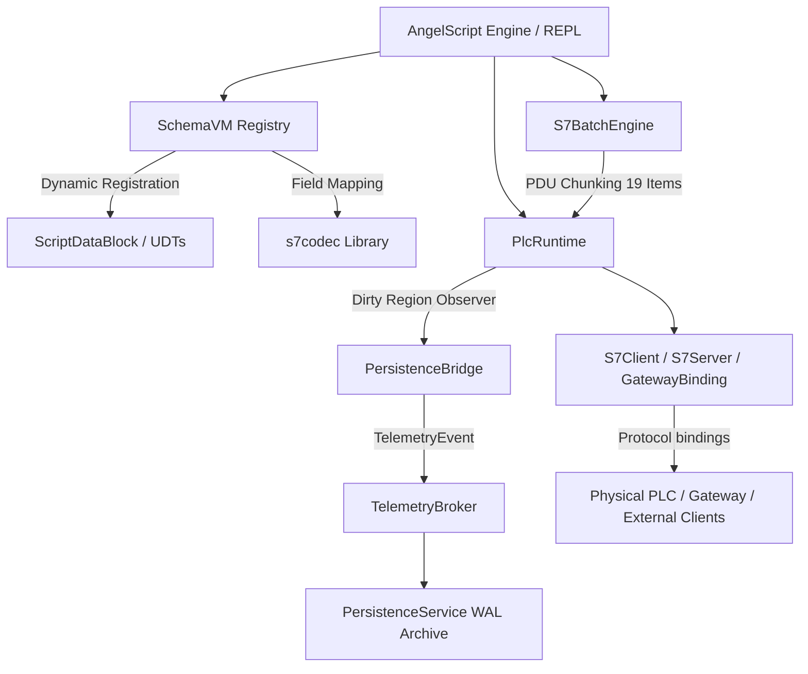

# S7 Automation Shell (`s7shell`)

`s7shell` is a high-performance, programmable interactive environment and scripting engine for Siemens S7 PLC automation.

---

##  Utility of the Software

In industrial automation environments (such as water treatment, power, and manufacturing plants), interacting with Siemens S7 PLCs typically requires specialized proprietary software (e.g., TIA Portal) or custom C++/C# compilation.

`s7shell` bridges this gap by providing an **interpreted scripting shell** powered by **AngelScript**, combined with a **Schema-Driven Virtual Machine** that automatically registers complex PLC structures as native script variables.

---

###  Use Case 1 — Interactive REPL Commissioning

Connect directly to a live PLC in seconds. Inspect registers, force outputs, and diagnose network connectivity without a TIA Portal installation.

```bash
$ s7shell
s7> S7Client@ plc = S7Client("192.168.1.10", 0, 1);
s7> plc.loadSclSchema("plant.scl");
s7> plc.db(1).get()          // fetch DB1 from PLC, auto-print as JSON
{
  "motor": { "speed": 1450.0, "temp": 72.3, "running": true },
  "setpoint": 1500.0
}
s7> plc.PrimaryCoolant       // typed property shorthand (schema required)
{ "temp_pv": 85.0, "on": true }
s7> plc.diagnostics().cpuInfo()
```

---

###  Use Case 2 — Soft PLC / Hardware-in-the-Loop

Spin up a virtual S7-300 on port 102. SCADA systems and HMI panels connect to `s7shell` exactly as they would to a real PLC. Drive the simulation from a script.

```as
// hil_tank.as — Tank-fill HIL simulation
PlcRuntime@ rt = PlcRuntime();
rt.loadSclSchema("tank.scl");

S7Server@ srv = S7Server(rt, "0.0.0.0");
srv.start();
print("Soft PLC listening on port 102 — " + srv.clientsCount() + " clients");

// Simulate tank filling at 0.5 L/s
double level = 0.0;
while (srv.isRunning()) {
    level = level + 0.05;          // 0.05 L per 100 ms tick
    if (level > 100.0) level = 0.0;

    rt.set(1, "tank.level",     "" + level);
    rt.set(1, "tank.valve_in",  level < 80.0 ? "true" : "false");
    rt.set(1, "tank.valve_out", level > 90.0 ? "true" : "false");
    sleep(100);
}
srv.stop();
```

Run headless: `s7shell hil_tank.as`

---

###  Use Case 3 — Symbolic Tag Table Control

Load a JSON tag registry to interact with Inputs (`PE`), Outputs (`PA`), and Memory Markers (`MK`) by name — no manual address arithmetic.

```as
// tags.as — monitor sensors, force an actuator
S7Client@ plc = S7Client("192.168.1.10", 0, 1);
plc.loadRegistry("plant_tags.json");

TagTable@ tags = plc.tags();
tags.get();   // fetch all registered tags from PLC

print("Pressure:  " + tags.get("pressure_pv"));
print("Valve 1:   " + tags.get("valve_1"));
print("Run mode:  " + tags.get("run_mode"));

// Override — force valve open
tags.put("valve_1", true);
print("Valve 1 forced open.");
```

---

###  Use Case 4 — PDU-Optimised Batch Extraction

Read dozens of scattered fields in the fewest possible PDU round-trips using `S7BatchEngine`. Siemens limits a single PDU to 19 items; `S7BatchEngine` chunks automatically.

```as
// batch_read.as — extract 60 fields across 3 DBs in optimal batches
S7Client@ plc = S7Client("192.168.1.10", 0, 1);
plc.loadSclSchema("plant.scl");

// Bulk-fetch entire DBs
DataBlock@ db1 = plc.db(1).get();
DataBlock@ db2 = plc.db(2).get();
DataBlock@ db3 = plc.db(3).get();

// Decode symbolically
print("Motor speed:     " + db1.get("motor.speed"));
print("Coolant temp:    " + db2.get("coolant.temp_pv"));
print("Pump flow rate:  " + db3.get("pump.flow_L_s"));

// Or dump everything as JSON for offline analysis
print(db1.toJson());
```

---

###  Use Case 5 — Diagnostic Inspection

Audit a PLC without opening TIA Portal. Dump the diagnostic buffer, inspect SZL tables, and verify CPU state.

```as
// diagnostics.as
S7Client@ plc = S7Client("192.168.1.10", 0, 1);

print(plc.diagnostics().cpuInfo());
print(plc.diagnostics().status());
print(plc.diagnostics().diagnosticBuffer(20));   // last 20 entries

// List all blocks loaded in PLC memory
print(plc.diagnostics().listBlocks());

// Low-level SZL read (System Status List)
print(plc.diagnostics().szl(0x0131, 0x0001));
```

---

###  Use Case 6 — Headless Live Recording

Continuously record all DB changes to a compressed WAL archive. Only changed byte regions are written — idle polls produce zero bytes.

```as
// record.as — run with: s7shell record.as
PlcRuntime@ rt = PlcRuntime();
rt.loadSclSchema("plant.scl");
S7Client@ plc = S7Client("192.168.1.10", 0, 1, 102, rt);

if (!plc.isConnected()) {
    print("Connection failed: " + plc.lastError());
    return;
}

Persistence@ pers = Persistence(rt, "./archive/");
pers.configure("./archive/", "binary", "changes_with_timestamp");
pers.start();

int64 start = now_ms();
int64 duration_ms = 3600 * 1000;   // 1 hour

while (now_ms() - start < duration_ms) {
    plc.db(1).get();
    plc.db(2).get();
    sleep(500);
}

pers.stop();
print("Archive written to " + pers.outDir());
```

---

###  Use Case 7 — GatewaySync Live State Introspection

Attach to a running SGRN Gateway over WebSocket. The local `PlcRuntime` stays in sync with the live plant state — no additional load on the PLC network.

```as
// gateway_watch.as
PlcRuntime@ rt = PlcRuntime("plant.scl");
GatewaySync@ sync = GatewaySync(rt);
sync.subscribeDb(1);
sync.subscribeDb(2);
sync.connect("ws://192.168.1.1:8080/ws");

// Live values update in rt as Gateway pushes deltas
while (true) {
    print("Motor speed: " + rt.get(1, "motor.speed"));
    print("Coolant:     " + rt.get(2, "coolant.temp_pv"));
    sleep(1000);
}
```

---

###  Use Case 8 — Remote Write Injection via Gateway

Read live state from the Gateway, apply a correction, and publish the delta back through the Gateway's HTTP ingestion path to safely write to the physical PLC.

```as
// override.as — raise motor setpoint by 50 RPM via Gateway
PlcRuntime@ rt = PlcRuntime("plant.scl");
GatewaySync@ sync = GatewaySync(rt);
sync.publishOnDirty(true);      // outbound dirty regions → Gateway HTTP API
sync.connect("ws://192.168.1.1:8080/ws");

sleep(500);   // allow initial sync frame to arrive

double current_sp = 0.0;
// parse current_sp from rt...

rt.set(1, "motor.setpoint", "" + (current_sp + 50.0));
// markDirty fires → GatewaySync publishes delta → Gateway writes to PLC
```

---

###  Use Case 9 — Watchdog / Automated Plant Response

Monitor live telemetry and trigger protective actions if a threshold is breached. No polling load on the PLC — the Gateway pushes changes.

```as
// watchdog.as
PlcRuntime@ rt = PlcRuntime("plant.scl");
GatewaySync@ sync = GatewaySync(rt);
sync.publishOnDirty(true);
sync.connect("ws://192.168.1.1:8080/ws");

int trip_count = 0;

while (true) {
    sleep(200);

    double temp = 0.0;
    // parse temp from rt.get(1, "coolant.temp_pv") ...

    if (temp > 95.0) {
        print("[WATCHDOG] Over-temperature! " + temp + " °C — tripping pump.");
        rt.set(1, "pump.running", "false");   // write trips via Gateway
        trip_count++;
        if (trip_count >= 3) {
            print("[WATCHDOG] 3 consecutive trips — raising alarm.");
            rt.set(1, "alarm.high_temp", "true");
        }
    } else {
        trip_count = 0;
    }
}
```

---

###  Use Case 10 — Edge Proxy: legacy PLC → Hub PLC

Run `s7shell` on an edge device with no cloud connectivity. Poll a legacy S7-300 and forward deltas to a hub S7-400 without storing anything centrally.

```as
// proxy.as
S7Client@ legacy = S7Client("10.0.0.5",  0, 2);   // legacy S7-300
S7Client@ hub    = S7Client("10.0.0.1",  0, 1);   // hub S7-400

S7ProxySession@ proxy = S7ProxySession(legacy, hub);
proxy.addMapping(1, 10, 500, 512);   // legacy DB1 → hub DB10, 500 ms, 512 bytes
proxy.addMapping(2, 11, 500, 256);   // legacy DB2 → hub DB11
proxy.start();

print("Proxy running. Press Ctrl-C to stop.");
while (true) { sleep(10000); }
```

---

##  Integration Runtime CLI

`s7shell` serves as a **lightweight industrial integration runtime** (similar to Bun or Node.js, but tailored for PLC & Gateway automation glue code).

```bash
# 1. Execute an AngelScript integration script directly
s7shell integration.as
s7shell run integration.as

# 2. Launch interactive REPL session
s7shell

# 3. Emit built-in AngelScript Linter & IDE completion headers
s7shell emit-as ./generated/
```

### CLI Reference

| Command / Flag            | Example                        | Description                                               |
| ---------------------------| --------------------------------| -----------------------------------------------------------|
| `s7shell [script.as]`     | `s7shell main.as`              | Execute an AngelScript integration script directly        |
| `s7shell run [script.as]` | `s7shell run main.as`          | Explicit execution subcommand (Bun-like)                  |
| `s7shell emit-as [dir]`   | `s7shell emit-as ./generated/` | Emit `s7shell_api.as` header for Neovim / VS Code linters |
| `-s, --schema <path>`     | `s7shell -s plant.scl main.as` | Pre-load an SCL schema before script execution            |
| `-m, --man`               | `s7shell --man`                | Print user manual and API summary                         |

---

##  Architecture



### 1. Schema-Driven Virtual Machine (`SchemaVM`)
Exposes complex S7 Data Blocks (DBs) and User-Defined Types (UDTs) directly to the scripting engine.
* **Metadata Parsing**: Parses `.scl` or `.json` schema definitions.
* **Dynamic RefTypes**: Registers DB structures as native AngelScript reference types.
* **Virtual Property Accessors**: Automatically generates getters and setters for all fields (supporting nested structures, arrays, and primitive types). Getters/setters perform on-the-fly network-buffer decoding/encoding with correct endianness via `s7codec`.

### 2. PDU-Aware Batch Engine (`S7BatchEngine`)
Siemens S7 communication relies on PDUs (Protocol Data Units), which impose limits on the size and number of variables in a single network request. 
* **Transparent Chunking**: `S7BatchEngine` transparently aggregates multiple reads or writes and chunks them into optimal 19-item transactions, protecting the user from PDU boundary concerns.

### 3. Symbolic Tag Table (`PlcTagTable`)
Manages sparse symbolic tags (inputs, outputs, memory markers, DB tags) loaded from JSON registries, aligning symbolic names to raw PLC addresses (`DB`, `MK`, `PA`, `PE`).

### 4. Runtime-Centered Bindings (`PlcRuntime`)
`PlcRuntime` is the single owner of schema, memory, tag tables, DB providers and dirty-region state. Every protocol endpoint attaches to a runtime in one of two roles:

* **Client binding:** initiates a connection to a target while using the runtime as local state, e.g. `S7Client(ip, rack, slot, port, rt)`.
* **Server binding:** listens for external clients and exposes a local runtime, e.g. `S7Server(rt)`.
* **Persistence binding:** attaches `PersistenceBridge` to record dirty regions via `TelemetryBroker` to WAL.
* **HTTP binding:** exposes `PlcMemory` and schema as a REST API via the gateway's `HttpAdapter`.
* **WebSocket binding:** streams live delta frames to WebSocket clients via the gateway's `WebSocketAdapter` subscribing to `TelemetryBroker`.

```
Script write / db.get() / SimEngine
       │ markDirtyDiff
       ▼
  TelemetryBroker::instance()
       ├── PersistenceService  → .bin.zst WAL archive
       └── WebSocketAdapter    → JSON delta frames to WS clients

  PlcMemory (always current)
       └── HttpAdapter         → REST GET/POST /data/<path>
```

---

##  Scripting & REPL API

Start the REPL using:
```bash
$ ./s7shell
```
*Tip: Entering a bare object expression in the REPL prints it automatically. Primitives (int, float, bool) print as-is.*

###  Siemens Types
Native representation for all standard types:
`BOOL`, `SINT`, `USINT`, `BYTE`, `INT`, `UINT`, `WORD`, `DINT`, `UDINT`, `DWORD`, `LINT`, `ULINT`, `LWORD`, `REAL`, `LREAL`, `TIME` (ms), `LTIME` (ns), `DATE` (days), `TOD` (ms), `LTOD` (ns).

###  Global Utilities
```as
sleep(500)            // block script thread for N milliseconds (wall-clock, real wait)
int64 t = now_ms()    // wall-clock time in milliseconds since epoch
string env = getEnv("PLC_IP")   // read an environment variable
```

###  Virtual PLC Runtime (`PlcRuntime`)
```as
PlcRuntime@ rt = PlcRuntime()                       // empty, load schema later
PlcRuntime@ rt = PlcRuntime("plant.scl")            // load SCL schema on creation
rt.loadSclSchema(path) / rt.loadJsonSchema(path) / rt.loadRegistry(path)
rt.registerDb(num, size, name)  /  rt.registerUdt(name, size)
rt.set(db, "field.path", "value_json")  // write field by symbolic path
rt.get(db, "field.path")                // read field → JSON string
rt.getJson(db)                          // dump full DB as JSON
rt.setBit(db, byte_offset, bit, bool)   // raw bit write
rt.hasDirty(db)                         // check if any dirty regions
rt.DBS()                                // Introspect loaded Data Blocks (rich table)
rt.UDTS()                               // Introspect loaded UDT definitions (rich table)
```

> **Note**: `rt.loadSclSchema(path)` auto-injects `DataBlock@` globals; the constructor form `PlcRuntime("plant.scl")` does not (call `loadSclSchema` explicitly afterward if you want globals).

###  Persistence & WAL Recording (`Persistence`)
Bridges `PlcRuntime` dirty-region observers into the canonical `TelemetryBroker` → `PersistenceService` pipeline, producing WAL archives **identical** in format to those recorded from a real S7 adapter.

#### How it works internally

Every time a Data Block region changes — whether from a **field write in a script**, a `SimEngine` tick, or a **live `db.get()`** call that fetches new bytes from a physical PLC — `PlcRuntime` fires a dirty-region notification. `PersistenceBridge` subscribes to those notifications, serialises the changed byte range as a `TelemetryEvent` (DeltaSnapshot), and publishes it to `TelemetryBroker`. `PersistenceService` consumes these events and writes them into a compressed WAL archive (`.bin.zst` or `.jsonl.zst`) under `<out_dir>/unsynced/`.

**What triggers a dirty event:**
- **Script write** (`db.write(field, val)` / typed property assignment): fires immediately on the changed bytes.
- **`db.get()` with a runtime attached**: after fetching fresh bytes from the PLC, the new snapshot is diffed byte-by-byte against the previous one; only the changed regions are fired as dirty events.
- **`SimEngine.run()`**: each tick applies state mutations that internally call write paths.

```
Script write / SimEngine tick
       │ write path → markDirtyDiff(db, offset, before, after)
       ▼
  PlcRuntime (dirty observer list)
       │
       ▼
  PersistenceBridge.onDirty()
       │ reads region from PlcMemory → TelemetryEvent{DeltaSnapshot}
       ▼
  TelemetryBroker  ←── same broker used by the real S7 Gateway adapters
       │
       ▼
  PersistenceService
       │
       ▼
  <out_dir>/unsynced/run_<timestamp>.bin.zst


db.get() from a live PLC
       │ fetch PDU bytes from PLC via TCP
       ▼
  diff new snapshot vs previous snapshot
       │ changed regions → markDirtyDiff(db, 0, old_buf, new_buf, size)
       ▼                (same observer pipeline as above)
  PersistenceBridge → TelemetryBroker → PersistenceService → .bin.zst
```

#### API reference

| Method      | Signature                         | Description                                                                  |
| -------------| -----------------------------------| ------------------------------------------------------------------------------|
| Constructor | `Persistence(rt)`                 | Attach to a runtime; output defaults to `"."`                                |
| Constructor | `Persistence(rt, outDir)`         | Attach and set output directory immediately                                  |
| `configure` | `configure(outDir)`               | Set output dir; format & mode default to `binary` / `changes_with_timestamp` |
| `configure` | `configure(outDir, format, mode)` | Full control over format and archival mode                                   |
| `start`     | `start()`                         | Begin recording — registers the dirty observer                               |
| `flush`     | `flush()`                         | Force WAL rotation (finalise current archive, open a fresh one)              |
| `stop`      | `stop()`                          | Stop recording — unregisters observer and finalises the archive              |
| `isActive`  | `isActive() → bool`               | True between `start()` and `stop()`                                          |
| `outDir`    | `outDir() → string`               | Returns the configured output directory                                      |

**Format values**: `"binary"` (compact `.bin.zst`, default) · `"jsonl"` (human-readable `.jsonl.zst`)

**Mode values**:

| Mode                       | Description                                                           |
| ----------------------------| -----------------------------------------------------------------------|
| `"changes_with_timestamp"` | Records only changed byte regions + timestamp (default, most compact) |
| `"full_tree"`              | Writes the full DB snapshot on every tick                             |
| `"full_tree_with_anchor"`  | `changes_with_timestamp` + periodic full-tree anchor frames           |

---

#### Example 1 — Record a live PLC session

Poll a physical S7 PLC at 500 ms, record all changes to a compressed `.bin.zst` WAL archive.
Every `db.get()` diffs the fresh bytes against the previous snapshot; **only changed regions** flow into the archive — identical polls produce zero bytes of output.

```as
// ─── Setup ─────────────────────────────────────────────────────────────────
PlcRuntime@ rt = PlcRuntime();
rt.loadSclSchema("plant.scl");          // load schema so DB sizes are known

// Attach S7Client to the shared runtime so get() can drive markDirtyDiff
S7Client@ client = S7Client("192.168.1.10", 0, 1, 102, rt);

if (!client.isConnected()) {
    print("[record] Connection failed: " + client.lastError());
    return;
}

// ─── Start Persistence ─────────────────────────────────────────────────────
Persistence@ pers = Persistence(rt, "./records/");
pers.configure("./records/", "binary", "changes_with_timestamp");
pers.start();
print("[record] Archiving to " + pers.outDir());

// ─── Poll loop — 500 ms × 1200 ticks = 10 minutes ──────────────────────────
for (int i = 0; i < 1200; i++) {
    client.db(1).get();   // fetch DB1 → diff vs last snapshot → dirty events → WAL
    client.db(2).get();   // fetch DB2

    if (i % 120 == 0)     // progress print every minute
        print("[record] tick " + i + " / 1200");

    sleep(500);           // sleep(ms) — built-in global, real wall-clock wait
}

// ─── Finalise ───────────────────────────────────────────────────────────────
pers.stop();
print("[record] Done. Archive: " + pers.outDir() + "/unsynced/");
```

#### Example 2 — Synthetic dataset with `SimEngine`

```as
// Generate a 1-hour bearing-degradation dataset, fully reproducible.
SimParams@ p  = SimParams();
p.seed        = 4219;
p.duration_s  = 3600;
p.timestep_ms = 100;
p.noise_level = 0.02;
p.fault       = "bearing_degradation";

PlcRuntime@  rt   = PlcRuntime("plant.scl");
Persistence@ pers = Persistence(rt, "./datasets/bearing/");
pers.configure("./datasets/bearing/", "binary", "changes_with_timestamp");
pers.start();

SimEngine@ sim = SimEngine(rt, p);
sim.run();      // advances PlcSimClock — no real-time waiting

pers.stop();   // ./datasets/bearing/unsynced/run_<ts>.bin.zst
```

#### Example 3 — Periodic WAL rotation with `flush()`

Use `flush()` to cut the WAL into smaller per-hour segments without stopping the session. Useful for long-running soft PLCs or proxy sessions.

```as
PlcRuntime@ rt     = PlcRuntime("plant.scl");
S7Client@   client = S7Client("192.168.1.10", 0, 1, 102, rt);

Persistence@ pers = Persistence(rt, "./archive/");
pers.configure("./archive/", "binary", "full_tree_with_anchor");
pers.start();

// Record for 8 hours, flushing a new WAL file every hour
for (int hour = 0; hour < 8; hour++) {
    for (int tick = 0; tick < 7200; tick++) {   // 7200 × 500 ms = 1 h
        client.db(1).get();
        sleep(500);
    }
    pers.flush();   // close current .bin.zst, open the next one
    print("Hour " + hour + " archived to " + pers.outDir());
}

pers.stop();
```

#### Example 4 — Human-readable JSONL archive

Use `"jsonl"` format when you want to inspect raw frames with `jq` or load them into a DataFrame without the replay tool.

```as
PlcRuntime@  rt   = PlcRuntime("plant.scl");
Persistence@ pers = Persistence(rt, "./debug/");
pers.configure("./debug/", "jsonl", "changes_with_timestamp");
pers.start();

// Manual mutation in REPL / script — every set() call triggers a frame
rt.set(1, "motor.speed",  "1450.0");
rt.set(1, "motor.temp",   "72.3");
rt.set(1, "motor.running","true");

pers.stop();   // ./debug/unsynced/run_<ts>.jsonl.zst
// zstdcat ./debug/unsynced/run_*.jsonl.zst | jq .
```

### 🎲 Deterministic Simulation Engine (`SimParams` & `SimEngine`)

Programmatic, **deterministic** synthetic data generator for ML dataset creation and hardware-in-the-loop testing.
The engine drives a `PlcRuntime` through a reproducible sequence of state mutations governed by a PRNG seed, an optional noise amplitude, and a named fault scenario. It advances the `PlcSimClock` internally so that `Persistence` timestamps are consistent with wall-clock semantics without real waiting.

```as
// ─── Configure simulation parameters ───────────────────────────────────────
SimParams@ p = SimParams();
p.seed        = 4219;                   // PRNG seed — same seed ⟹ same dataset
p.duration_s  = 3600;                   // simulated horizon (seconds)
p.timestep_ms = 100;                    // tick resolution (milliseconds)
p.noise_level = 0.02;                   // fractional Gaussian noise added to outputs
p.fault       = "bearing_degradation";  // named fault scenario (empty ⟹ nominal)

// ─── Wire Persistence pipeline ─────────────────────────────────────────────
PlcRuntime@ rt   = PlcRuntime("plant.scl");
Persistence@ pers = Persistence(rt, "./dataset/");
pers.configure("./dataset/", "binary", "changes_with_timestamp");
pers.start();

// ─── Run (blocking) ────────────────────────────────────────────────────────
SimEngine@ sim = SimEngine(rt, p);
sim.run();      // ticks PlcSimClock; every dirty region is captured by Persistence

pers.flush();   // rotate WAL / write anchor frame
pers.stop();    // finalise .bin.zst archive
```

#### `SimParams` properties
| Property      | Type     | Description                                                                                |
| ---------------| ----------| --------------------------------------------------------------------------------------------|
| `seed`        | `uint64` | PRNG seed. Equal seeds produce identical output.                                           |
| `duration_s`  | `uint32` | Simulated duration in seconds.                                                             |
| `timestep_ms` | `uint32` | Clock advancement per tick in ms (default `100`).                                          |
| `noise_level` | `double` | Fractional Gaussian noise amplitude (default `0.0`).                                       |
| `fault`       | `string` | Named fault scenario (e.g. `"bearing_degradation"`, `"pump_cavitation"`). Empty ⟹ nominal. |

#### `SimEngine` methods
| Method                  | Description                                                        |
| -------------------------| --------------------------------------------------------------------|
| `SimEngine(rt, params)` | Construct bound to a `PlcRuntime` and a `SimParams`.               |
| `run()`                 | Execute simulation loop until `duration_s` is exhausted. Blocking. |

---

###  WAL Archive Replayer (`WalReplayer`)

Rate-controlled playback of binary (`.bin.zst`) or JSONL (`.jsonl.zst`) WAL archives into a live `PlcRuntime` digital twin. Useful for replaying previously recorded or generated datasets through additional processing pipelines.

```as
// ─── Basic replay at 2× realtime ──────────────────────────────────────────
WalReplayer@ replayer = WalReplayer("pump_run.bin.zst");
replayer.speed(2.0);   // 2× realtime; use 0.0 for as-fast-as-possible
replayer.run();

// ─── Replay into a shared runtime for further processing ──────────────────
PlcRuntime@ rt        = PlcRuntime("plant.scl");
WalReplayer@ replayer = WalReplayer("bearing_fault.bin.zst");
replayer.speed(1.0);
replayer.run();   // frames are applied back into rt
```

#### `WalReplayer` methods
| Method | Description |
|---|---|
| `WalReplayer(path)` | Open a `.bin.zst` or `.jsonl.zst` archive. |
| `speed(multiplier)` | Set playback rate (1.0 = realtime, 0.0 = no throttle). |
| `run()` | Start playback. Blocking until archive is exhausted. |

###  Virtual PLC Server (`S7Server`)
Provides a Soft PLC behavior serving the shared `PlcRuntime` to incoming connections.
```as
S7Server@ srv = S7Server(rt, "0.0.0.0")        // bind runtime to S7 server
srv.start() / srv.stop()                       // lifecycle
srv.isRunning() / srv.clientsCount() / srv.getCpuStatus()
```

###  PLC Connection (`S7Client`)
```as
S7Client@ client = S7Client(ip, rack, slot)
S7Client@ client = S7Client(ip, rack, slot, port, rt)  // attach to shared runtime
client.isConnected() / client.ping() / client.disconnect() / client.reconnect()
client.reconnectOk() / client.reconnectWithRetry(maxAttempts = 3, delayMs = 500)
client.lastError() / client.lastErrorCode() / client.lastOpOk() / client.clearLastError()
client.read(address) / client.write(address, hex)   // raw, unschematized access
DataBlock@ db = client.db(42) / client.db("DBName")
TagTable@ tags = client.tags()
S7Connection@ conn = client.connection()   // low-level connection tuning
```

###  Typed Property Accessors (Soft PLC & Field PLC)
After an explicit call to `<var>.loadSclSchema(path)`, all DBs become available as **typed properties** on the `PlcRuntime` or `S7Client` object (both PascalCase and snake_case supported):
```as
rt.PrimaryCoolant.get("temp_pv")
client.primary_coolant.set("on", "true")

// In the REPL, bare expressions trigger an automatic memory readout
s7> client.PrimaryCoolant
{
  "temp_pv": 85.0,
  "on": true
}
```

###  DataBlock API
```as
db.get() / db.put()                       // fetch/flush the whole DB
db.get(path) / db.put(path, val)          // single field, immediate read/write
db.write(path, val)                       // stage into local buffer, no PLC I/O until put()
db["field.path"]  → FieldProxy@           // opIndex shorthand
db.path("field.path")  → S7PathBatch@     // fluent access
db.toJson() / db.diff() / db.number() / db.name() / db.print()
```

###  S7PathBatch (Fluent Batched Access)
```as
S7PathBatch@ b = db.path("field.path");
b.write(val).write(val2)...   // chainable, stages one or more values
b.put()                       // flush staged writes to the PLC
b.get()                       // refresh from the PLC
b.read()                      // current value → string
```

###  Diagnostics & Memory
```as
S7Diagnostics@ d = client.diagnostics();
d.cpuInfo() / d.status() / d.diagnosticBuffer(10) / d.listBlocks()

S7Memory@ m = client.memory();
m.readArea(Area_DB,db,start,size,wordLen) / m.writeArea(...)
m.readAddress(address, size) / m.writeAddress(address, hex)
m.readDB(...) / m.readMB(...) / m.readEB(...) / m.readAB(...)
```

---

###  IDE & Tooling Support (`sclc emit-angelscript`)

Generate declaration-only `.as` header files for code completion and linter integration in editors:

```bash
# Generate schema surface (DB globals / UDT classes) from SCL schema
sclc as plant.scl -o generated/                 # → schema.as

# Include built-in S7Shell API declarations (PlcRuntime, Persistence, SimEngine, etc.)
sclc as plant.scl -o generated/ --include-shell-api   # → + s7shell_api.as

# Complete ambient header (native API + schema surface) for IDE language servers
sclc as plant.scl -o generated/ --include-predefined  # → as.predefined
```

> `--include-predefined` and `--include-shell-api` are **mutually exclusive**:
> both would declare the native API surface into the same directory.
> Generated files are declaration-only, for IDE autocompletion/linting. They are
> never loaded by the AngelScript runtime.

---

##  Embedded Proxy & Gateway Bindings

### Proxy (`S7ProxySession`)
Mirror DBs from a field PLC to a hub PLC via periodic polling (suppresses redundant traffic through dirty-change detection).
```as
S7ProxySession@ proxy = S7ProxySession(srcClient, hubClient);
proxy.addMapping(1, 1, 100, 512); // srcDB=1 → dstDB=1, 100ms interval, 512 bytes
proxy.start();
```

### Gateway Sync (`GatewaySync`)
Attaches a runtime to an SGRN Gateway. Inbound Gateway deltas arrive over WebSocket; outbound local dirty regions are published over the Gateway's existing HTTP ingestion path.
```as
PlcRuntime@ rt = PlcRuntime("schema.scl");
GatewaySync@ sync = GatewaySync(rt);
sync.subscribeDb(1);
sync.publishOnDirty(true);
sync.connect("ws://192.168.1.1:8080/ws");
```

### HTTP REST Server (`HttpServer`)
Reuses the gateway's `HttpAdapter` directly to expose live `PlcRuntime` memory and SCL schema over HTTP REST.

```as
PlcRuntime@ rt = PlcRuntime("plant.scl");
HttpServer@ http = HttpServer(rt);
http.start("0.0.0.0", 8080);   // listen on port 8080

// REST Endpoints:
// GET  http://localhost:8080/data/             -> full digital twin JSON
// GET  http://localhost:8080/data/motor.speed  -> "1450.0"
// POST http://localhost:8080/data/motor.speed  body: {"value": 1500}
// GET  http://localhost:8080/registry          -> SCL schema registry JSON

http.loadPolicy("security.as");  // optional ACL security policy script
http.stop();
```

#### `HttpServer` Methods
| Method       | Signature                | Description                                    |
| --------------| --------------------------| ------------------------------------------------|
| Constructor  | `HttpServer(rt)`         | Attach to a `PlcRuntime`                       |
| `start`      | `start(ip, port = 8080)` | Start listening for REST requests              |
| `stop`       | `stop()`                 | Stop the server                                |
| `isRunning`  | `isRunning() -> bool`    | Returns `true` if server is active             |
| `loadPolicy` | `loadPolicy(path)`       | Load gateway-compatible security policy script |

---

### WebSocket Live Stream Server (`WebSocketServer`)
Reuses the gateway's `WebSocketAdapter` directly. Subscribes to `TelemetryBroker::instance()` so every dirty region (script write, `SimEngine` tick, or live `db.get()` diff) automatically broadcasts as JSON delta frames to all connected WebSocket clients.

```as
PlcRuntime@ rt = PlcRuntime("plant.scl");
Persistence@ pers = Persistence(rt, "./records/");
pers.start();   // enables dirty observer publishing to TelemetryBroker

WebSocketServer@ ws = WebSocketServer(rt);
ws.start("0.0.0.0", 9001);   // listen on port 9001

// WS clients get full digital twin snapshot on connect, then live field-level deltas on every change.
ws.broadcast("{\"alert\":\"manual override active\"}");

ws.stop();
```

#### `WebSocketServer` Methods
| Method       | Signature                | Description                                             |
| --------------| --------------------------| ---------------------------------------------------------|
| Constructor  | `WebSocketServer(rt)`    | Attach to a `PlcRuntime`                                |
| `start`      | `start(ip, port = 9001)` | Start WebSocket server and subscribe to TelemetryBroker |
| `stop`       | `stop()`                 | Stop the WebSocket server                               |
| `isRunning`  | `isRunning() -> bool`    | Returns `true` if server is active                      |
| `broadcast`  | `broadcast(jsonStr)`     | Push arbitrary JSON payload to all connected WS clients |
| `loadPolicy` | `loadPolicy(path)`       | Load gateway-compatible security policy script          |

---

###  Standalone Micro-Gateway Example
Combine `S7Server`, `HttpServer`, `WebSocketServer`, and `Persistence` in a single script to turn `s7shell` into a complete, standalone gateway environment:

```as
// Complete standalone Micro-Gateway in s7shell
PlcRuntime@ rt = PlcRuntime("plant.scl");

// 1. Soft PLC server for S7 clients
S7Server@ s7 = S7Server(rt, "0.0.0.0");
s7.start();

// 2. HTTP REST server
HttpServer@ http = HttpServer(rt);
http.start("0.0.0.0", 8080);

// 3. WAL Recorder
Persistence@ pers = Persistence(rt, "./wal/");
pers.start();

// 4. WebSocket live stream server
WebSocketServer@ ws = WebSocketServer(rt);
ws.start("0.0.0.0", 9001);

print("[MicroGateway] Running S7:102, HTTP:8080, WS:9001");
```
```

---

##  Initialization Scripts

If you place an `angelscript.as` script in your working directory, it will automatically be evaluated on startup. You can define global client instances and helper routines in it:
```as
// angelscript.as
PlcRuntime@ rt = PlcRuntime("plant.scl");
S7Client@ plc = S7Client("192.168.1.10", 0, 1, 102, rt);

void cycle() {
    // some simulation logic
}
```
All variables and functions defined here are fully available in the REPL session.
