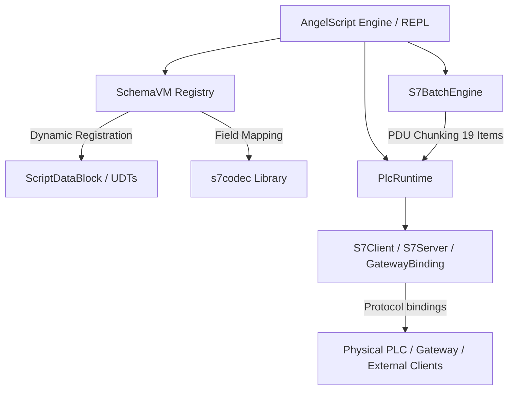

# S7 Automation Shell (`s7shell`)

`s7shell` is a high-performance, programmable interactive environment and scripting engine for Siemens S7 PLC automation.

---

## 🎯 Utility of the Software

In industrial automation environments (such as water treatment, power, and manufacturing plants), interacting with Siemens S7 PLCs typically requires specialized proprietary software (e.g., TIA Portal) or custom compilation of 
C++/C# applications.

`s7shell` bridges this gap by providing an **interpreted scripting shell** powered by **AngelScript**, combined with a **Schema-Driven Virtual Machine** that automatically registers complex PLC structures as native script variables.

`s7shell` is designed to be highly versatile. It can be used **entirely independently** as a standalone engineering tool, as a soft PLC or **complementary** to an active SGRN Gateway instance.

### Mode 1: Standalone Engineering Tool (Independent)
You do not need to run the SGRN Gateway to use `s7shell`. It is a more lightweight, instantly-launchable CLI alternative to TIA Portal fuzzing for scripting, testing, and soft control. 
It requires no massive IDE installation and consumes minimal system resources:
1. **Interactive Commissioning (REPL)**: Connect directly to a physical PLC, test registers, force inputs/outputs, and verify network connectivity using a live terminal.
2. **Soft Control & Hardware-in-the-Loop**: Instantiate an `S7Server` in `s7shell` to act as a Virtual Soft PLC. SCADA systems or HMI panels can connect to `s7shell` over port 102 as if it were a real S7-300. You can write scripts to simulate physical logic (e.g., tank levels filling, valves opening) entirely in software.
3. **Symbolic Tag Table Control**: Load JSON tag tables to interact symbolically with PLC Memory Markers (`MK`), Inputs (`PE`), and Outputs (`PA`). You can easily monitor sensors or force actuators from scripts: `tags.put("valve_1", true);`.
4. **PDU-Optimized Data Extraction**: Write scripts to fetch hundreds of PLC values in transaction-optimal batches.
5. **Diagnostic Inspections**: Access internal diagnostic buffers, CPU state, and SZL (System Status List) tables directly from the field PLC.
6. **Headless Script Execution**: Run automation routines without an interactive prompt (e.g., `s7shell my_script.as`).

### Mode 2: Companion to the Gateway (Complementary)
When the SGRN Gateway is actively monitoring a plant, `s7shell` becomes a powerful companion tool:
1. **Live State Introspection (`GatewaySync`)**: Attach `s7shell` to the Gateway's WebSocket telemetry stream. The shell's local `PlcRuntime` will magically stay in sync with the live plant state without causing additional load on the physical PLC network.
2. **Remote Write Injection**: Modify local memory in the shell and let `GatewaySync` publish the deltas back to the Gateway via its HTTP ingestion API, which then writes to the physical PLC safely.
3. **Automated Plant Response**: Write "watchdog" scripts in the shell that monitor the live telemetry stream. If a critical temperature drops, the script can automatically inject an override command back into the Gateway.
4. **Edge Proxying (`S7ProxySession`)**: Run `s7shell` on an edge device to poll a legacy PLC, and forward changes to a centralized Hub PLC.

---

## 🏗️ Architecture



### 1. Schema-Driven Virtual Machine (`SchemaVM`)
Exposes complex S7 Data Blocks (DBs) and User-Defined Types (UDTs) directly to the scripting engine.
* **Metadata Parsing**: Parses `.scl` or `.json` schema definitions.
* **Dynamic RefTypes**: Registers DB structures as native AngelScript reference types.
* **Virtual Property Accessors**: Automatically generates getters and setters for all fields (supporting nested structures, arrays, and primitive types). Getters/setters perform on-the-fly network-buffer decoding/encoding with correct endianness via `s7codec`.

### 2. PDU-Aware Batch Engine (`S7BatchEngine`)
Siemens S7 communication relies on PDUs (Protocol Data Units), which impose limits on the size and number of variables in a single network request. 
* **Transparent Chunking**: `S7BatchEngine` transparently aggregates multiple reads or writes and chunks them into optimal 19-item transactions, protecting the user from PDU boundary concerns.

### 3. Symbolic Tag Table (`PlcTagTable`)
Manages sparse symbolic tags (inputs, outputs, memory markers, DB tags) loaded from JSON registries, aligning symbolic names to raw PLC addresses (`DB`, `MK`, `PA`, `PE`).

### 4. Runtime-Centered Bindings (`PlcRuntime`)
`PlcRuntime` is the single owner of schema, memory, tag tables, DB providers and dirty-region state. Every protocol endpoint attaches to a runtime in one of two roles:

* **Client binding:** initiates a connection to a target while using the runtime as local state, e.g. `S7Client(ip, rack, slot, port, rt)`.
* **Server binding:** listens for external clients and exposes a local runtime, e.g. `S7Server(rt)`.

---

## 💻 Scripting & REPL API

Start the REPL using:
```bash
$ ./s7shell
```
*Tip: Entering a bare object expression in the REPL prints it automatically. Primitives (int, float, bool) print as-is.*

### 🛠️ Siemens Types
Native representation for all standard types:
`BOOL`, `SINT`, `USINT`, `BYTE`, `INT`, `UINT`, `WORD`, `DINT`, `UDINT`, `DWORD`, `LINT`, `ULINT`, `LWORD`, `REAL`, `LREAL`, `TIME` (ms), `LTIME` (ns), `DATE` (days), `TOD` (ms), `LTOD` (ns).

### 🧠 Virtual PLC Runtime (`PlcRuntime`)
```as
PlcRuntime@ rt = PlcRuntime()                       // empty, load schema later
PlcRuntime@ rt = PlcRuntime("plant.scl")            // load SCL schema on creation
rt.loadSclSchema(path) / rt.loadJsonSchema(path) / rt.loadRegistry(path)
rt.registerDb(num, size, name)  /  rt.registerUdt(name, size)
rt.set(db, "field.path", "value_json")  // write field by symbolic path
rt.get(db, "field.path")                // read field → JSON string
rt.getJson(db)                          // dump full DB as JSON
rt.setBit(db, byte_offset, bit, bool)   // raw bit write
rt.hasDirty(db)                         // check if any dirty regions
rt.DBS()                                // Introspect loaded Data Blocks (rich table)
rt.UDTS()                               // Introspect loaded UDT definitions (rich table)
```

> **Note**: `rt.loadSclSchema(path)` auto-injects `DataBlock@` globals; the constructor form `PlcRuntime("plant.scl")` does not (call `loadSclSchema` explicitly afterward if you want globals).

### 🖥️ Virtual PLC Server (`S7Server`)
Provides a Soft PLC behavior serving the shared `PlcRuntime` to incoming connections.
```as
S7Server@ srv = S7Server(rt, "0.0.0.0")        // bind runtime to S7 server
srv.start() / srv.stop()                       // lifecycle
srv.isRunning() / srv.clientsCount() / srv.getCpuStatus()
```

### 🔌 PLC Connection (`S7Client`)
```as
S7Client@ client = S7Client(ip, rack, slot)
S7Client@ client = S7Client(ip, rack, slot, port, rt)  // attach to shared runtime
client.isConnected() / client.ping() / client.disconnect() / client.reconnect()
client.reconnectOk() / client.reconnectWithRetry(maxAttempts = 3, delayMs = 500)
client.lastError() / client.lastErrorCode() / client.lastOpOk() / client.clearLastError()
client.read(address) / client.write(address, hex)   // raw, unschematized access
DataBlock@ db = client.db(42) / client.db("DBName")
TagTable@ tags = client.tags()
S7Connection@ conn = client.connection()   // low-level connection tuning
```

### 🗃️ Typed Property Accessors (Soft PLC & Field PLC)
After an explicit call to `<var>.loadSclSchema(path)`, all DBs become available as **typed properties** on the `PlcRuntime` or `S7Client` object (both PascalCase and snake_case supported):
```as
rt.PrimaryCoolant.get("temp_pv")
client.primary_coolant.set("on", "true")

// In the REPL, bare expressions trigger an automatic memory readout
s7> client.PrimaryCoolant
{
  "temp_pv": 85.0,
  "on": true
}
```

### 📦 DataBlock API
```as
db.get() / db.put()                       // fetch/flush the whole DB
db.get(path) / db.put(path, val)          // single field, immediate read/write
db.write(path, val)                       // stage into local buffer, no PLC I/O until put()
db["field.path"]  → FieldProxy@           // opIndex shorthand
db.path("field.path")  → S7PathBatch@     // fluent access
db.toJson() / db.diff() / db.number() / db.name() / db.print()
```

### 🔗 S7PathBatch (Fluent Batched Access)
```as
S7PathBatch@ b = db.path("field.path");
b.write(val).write(val2)...   // chainable, stages one or more values
b.put()                       // flush staged writes to the PLC
b.get()                       // refresh from the PLC
b.read()                      // current value → string
```

### 🩺 Diagnostics & Memory
```as
S7Diagnostics@ d = client.diagnostics();
d.cpuInfo() / d.status() / d.diagnosticBuffer(10) / d.listBlocks()

S7Memory@ m = client.memory();
m.readArea(Area_DB,db,start,size,wordLen) / m.writeArea(...)
m.readAddress(address, size) / m.writeAddress(address, hex)
m.readDB(...) / m.readMB(...) / m.readEB(...) / m.readAB(...)
```

---

## 🔄 Embedded Proxy & Gateway Bindings

### Proxy (`S7ProxySession`)
Mirror DBs from a field PLC to a hub PLC via periodic polling (suppresses redundant traffic through dirty-change detection).
```as
S7ProxySession@ proxy = S7ProxySession(srcClient, hubClient);
proxy.addMapping(1, 1, 100, 512); // srcDB=1 → dstDB=1, 100ms interval, 512 bytes
proxy.start();
```

### Gateway Sync (`GatewaySync`)
Attaches a runtime to an SGRN Gateway. Inbound Gateway deltas arrive over WebSocket; outbound local dirty regions are published over the Gateway's existing HTTP ingestion path.
```as
PlcRuntime@ rt = PlcRuntime("schema.scl");
GatewaySync@ sync = GatewaySync(rt);
sync.subscribeDb(1);
sync.publishOnDirty(true);
sync.connect("ws://192.168.1.1:8080");
```

---

## ⚙️ Initialization Scripts

If you place an `angelscript.as` script in your working directory, it will automatically be evaluated on startup. You can define global client instances and helper routines in it:
```as
// angelscript.as
PlcRuntime@ rt = PlcRuntime("plant.scl");
S7Client@ plc = S7Client("192.168.1.10", 0, 1, 102, rt);

void cycle() {
    // some simulation logic
}
```
All variables and functions defined here are fully available in the REPL session.
